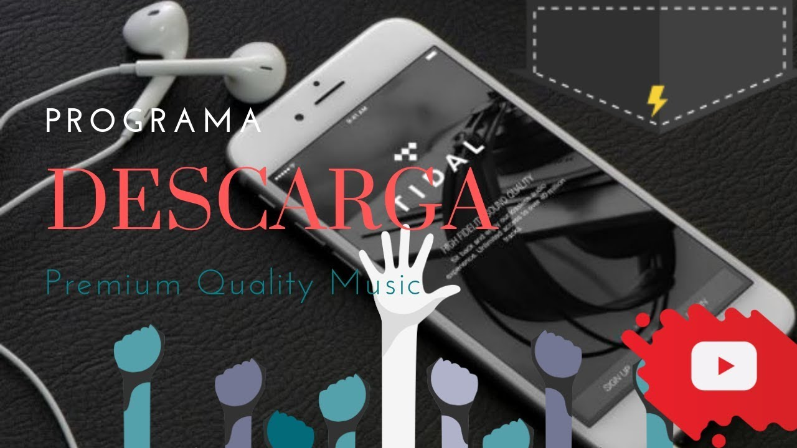

# ATHAME DESCARGA MUSICA DESDE TIDAL Y GOOGLE MUSIC

 

En un post anterior les dejé la forma para crearnos una [cuenta tidal](/blog/Cuenta-tidal-7meses-full-gratis-free/) por mas de medio año, ahora utilizaremos esa cuenta creada para bajarnos un poco de musica desde el servidor, la musica descargada es de alta calidad y esta en formato .flac , el programa funciona solamente en windows, asi que aquellos que contamos con linux hoy si nos freg** y hay que usar otra alternativa o correr virtualbox  :)

## VIDEO DESCRIPTIVO Y ABAJO LOS PASOS

<iframe width="560" height="315" src="https://www.youtube.com/embed/hZzSCc_K_v8" frameborder="0" allow="autoplay; encrypted-media" allowfullscreen></iframe>

1. Descarga el software desde este [LINK ATHAME](https://uniq.edu.mx/static/athame.html) 

- descomprimelo y ejecuta el archivo.

::: danger ALTO LEE
El descargar musica es ilegal, recuerda que los post generados aqui son solo para uso educativo y para hacer pruebas de vulnerabilidad, si eres estudiante de la universidad haz las pruebas y elimina al termminar
:::

2. En en apartado de **settings** encontraras una pestaña de logueo, inicia con tidal, y configura a tu gusto.

3. inicia sesion en tu cuenta tidal tambien desde el navegador y copia los links para descargar ya sea playlist o cancion (lo encontraras en compartir link)

4. pega el link en el programita y dale iniciar, se guardaran en la carpeta que hayas decidido en la seccion de **settings**.

5. cierra el programa, eliminalo y compartenos en facebook o twitter.